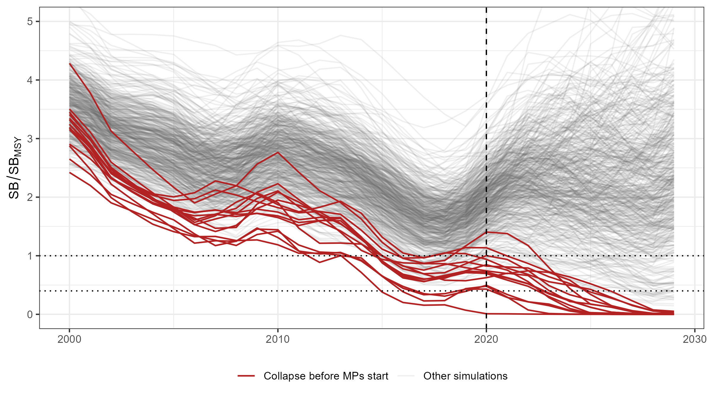
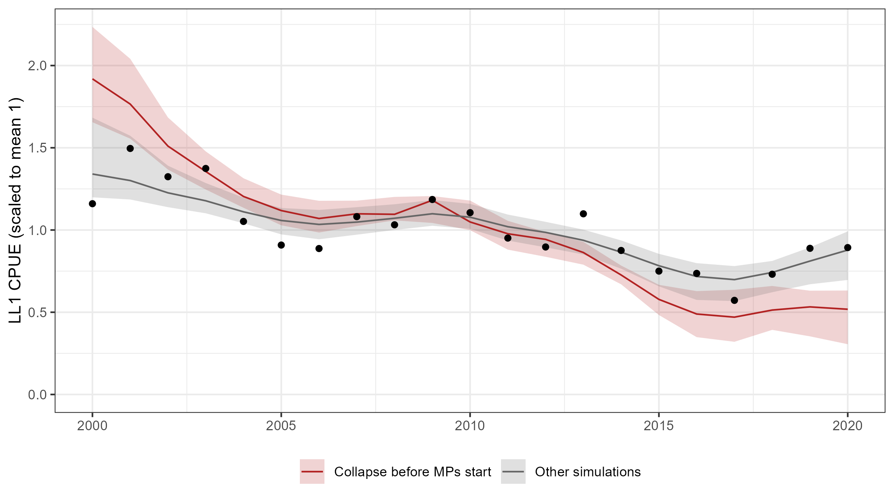

# Forward Projections {#sec-forward-projections}

```{r}
#| include: false
library(MSEtool)
library(iotcALB)
library(ggplot2)
Hist <- readRDS("../objects/Hist/OM5b.hist")
OM   <- Hist@OM
FirstManagementYear <- MPStartYear(OM)
HistYears <- unique(floor(Years(OM, 'H')))
ProjYears <- unique(floor(Years(OM, 'P')))
```

Each operating model has `r nSim(OM)` independent simulations with stochastic samples of the recruitment deviations, the observation error for the catch and index data, and the catches in the initial projection years (see below).

The projection period covers `r min(ProjYears)`--`r max(ProjYears)`, with `r OM@Seasons` quarterly time steps per year.

## Management Cycle and Data Lag

The MSE assumes that the first TAC set by the candidate management procedures (CMPs) will apply in `r FirstManagementYear`, with a `r Interval(OM)`-year management cycle and a `r DataLag(OM)`-year data lag. This means that the TAC for `r FirstManagementYear` is calculated in `r FirstManagementYear - 1` using data up to `r FirstManagementYear - DataLag(OM) - 1`, and the TAC is then updated every `r Interval(OM)` years (@tbl-mgmt-schedule). The CMPs are active for `r max(ProjYears) - FirstManagementYear + 1` years (`r FirstManagementYear`--`r max(ProjYears)`).

The TAC is set for each calendar year and applies to the total catch of all fleets. Within each year, the TAC is split among the quarters in proportion to the seasonal distribution of the catch over the last 5 historical years.

```{r}
#| label: tbl-mgmt-schedule
#| tbl-cap: The management interval and data lag used in the Indian Ocean albacore MSE.
#| echo: false
#| results: asis
MSEtool::ManagementScheduleTable(FirstYear = FirstManagementYear, DataLag = DataLag(OM), Interval = Interval(OM))
```

## Initial Projection Years {#sec-interim-years}

```{r}
#| include: false
InitYears <- ProjYears[ProjYears < FirstManagementYear]
DataYear1 <- FirstManagementYear - DataLag(OM) - 1
IA <- as.data.frame(MSEtool::InterimAdvice(OM))
IA$CalYear <- floor(IA$Year + 1e-8)
IAYear <- do.call(rbind, lapply(split(IA, IA$CalYear), \(d) data.frame(
  Year = d$CalYear[1], Mean = sum(d$Mean),
  CV   = sqrt(sum((d$CV * d$Mean)^2, na.rm = TRUE)) / sum(d$Mean))))
ReportedYears <- range(IAYear$Year[IAYear$CV == 0])
AssumedYears  <- range(IAYear$Year[IAYear$CV > 0])

# variability of the recent reported annual catches (2025 stock assessment data)
CatchCVYears <- 2014:2023
owd <- setwd('..')   # ProcessNewData() reads the data files relative to the project root
RecentCatch  <- iotcALB::ProcessNewData()$Landings
setwd(owd)
RecentCatch  <- rowsum(RecentCatch, floor(as.numeric(rownames(RecentCatch))))[as.character(CatchCVYears), ]
cvf <- function(x) stats::sd(x) / mean(x)
FleetCV <- apply(RecentCatch, 2, cvf)
TotalCV <- cvf(rowSums(RecentCatch))
```

The historical period of the OMs ends in `r max(HistYears)`, the terminal year of the conditioning data. Because the first TAC set by the CMPs will apply in `r FirstManagementYear`, the first `r length(InitYears)` years of the projection period (`r paste(range(InitYears), collapse = "--")`) are an extension of the historical period rather than years managed by the CMPs.

The catches in these interim years are (@tbl-interim-advice, @fig-interim-catch):

- **Reported catches** (`r paste(ReportedYears, collapse = '--')`): the quarterly catches of each fleet from the 2025 stock assessment data;
- **Assumed catches** (`r paste(AssumedYears, collapse = '--')`): for each fleet, the mean annual catch over `r paste(ReportedYears, collapse = '--')`, with lognormal variability (an assumed CV of 10% for each fleet).

Because the fleets are combined into a single fleet in the OMs (@sec-om-conditioning), the assumed catches are applied to the total catch of all fleets. The variability of the fleet catches is combined assuming they are independent, so the total assumed catch has a CV of about `r round(100 * mean(IAYear$CV[IAYear$CV > 0]))`% (@tbl-interim-advice), lower than the CV of each fleet.

```{r}
#| label: tbl-interim-advice
#| echo: false
#| tbl-cap: "The mean and assumed CV of the total annual catch (t, all fleets) in the initial projection years. The reported catches are fixed (CV = 0)."
knitr::kable(transform(IAYear, Year = as.character(Year)), digits = c(0, 0, 3), row.names = FALSE,
             format.args = list(big.mark = ','))
```

```{r}
#| label: fig-interim-catch
#| echo: false
#| fig-height: 4.5
#| fig-width: 9
#| fig-cap: !expr "paste0('Total annual catch (all fleets) in the Base Case OM up to ', FirstManagementYear - 1, ': the catches used in the conditioning (', paste(range(HistYears), collapse = '--'), '), the reported catches (', paste(ReportedYears, collapse = '--'), '), and the assumed catches (', paste(AssumedYears, collapse = '--'), '; mean and 90% interval). The dotted line shows the end of the historical period.')"
CondCatch <- iotcALB::albMSE_Data@Landings@Value
CondCatch <- rowSums(rowsum(CondCatch, floor(as.numeric(rownames(CondCatch)))))
CatchDF <- rbind(
  data.frame(Year = as.numeric(names(CondCatch)), Catch = CondCatch, Source = 'Conditioning data'),
  data.frame(Year = IAYear$Year[IAYear$Year %in% (ReportedYears[1]:ReportedYears[2])],
             Catch = IAYear$Mean[IAYear$Year %in% (ReportedYears[1]:ReportedYears[2])], Source = 'Reported'),
  data.frame(Year = IAYear$Year[IAYear$CV > 0], Catch = IAYear$Mean[IAYear$CV > 0], Source = 'Assumed'))
CatchDF$Source <- factor(CatchDF$Source, levels = c('Conditioning data', 'Reported', 'Assumed'))
# join the series at the start of each period
Joins <- rbind(CatchDF[CatchDF$Year == max(HistYears) & CatchDF$Source == 'Conditioning data', ],
               CatchDF[CatchDF$Year == ReportedYears[2] & CatchDF$Source == 'Reported', ])
Joins$Source <- factor(c('Reported', 'Assumed'), levels = levels(CatchDF$Source))
CatchDF <- rbind(CatchDF, Joins)
AssumedSD <- sqrt(log(1 + IAYear$CV[IAYear$CV > 0]^2))
Band <- data.frame(Year = IAYear$Year[IAYear$CV > 0],
                   lo = IAYear$Mean[IAYear$CV > 0] * exp(-0.5 * AssumedSD^2 - 1.645 * AssumedSD),
                   hi = IAYear$Mean[IAYear$CV > 0] * exp(-0.5 * AssumedSD^2 + 1.645 * AssumedSD))
ggplot(CatchDF, aes(Year, Catch / 1000)) +
  geom_ribbon(data = Band, aes(Year, ymin = lo / 1000, ymax = hi / 1000), inherit.aes = FALSE,
              fill = 'steelblue', alpha = 0.25) +
  geom_line(aes(colour = Source), linewidth = 0.9) +
  geom_point(aes(colour = Source), size = 1.2) +
  geom_vline(xintercept = max(HistYears), linetype = 3, colour = 'grey40') +
  scale_colour_manual(values = c('Conditioning data' = 'black', Reported = 'darkorange', Assumed = 'steelblue')) +
  expand_limits(y = 0) +
  labs(x = NULL, y = 'Total catch (kt)', colour = NULL) +
  theme_bw() + theme(legend.position = 'bottom')
```

::: {.callout-note title="Note on Assumed Data"}
As shown in @tbl-mgmt-schedule, the `r FirstManagementYear` TAC is calculated using data up to `r DataYear1`. The catch and index data for 2021--2023 are the reported data (@sec-updated-data), and the simulated data for 2024--`r DataYear1` are used by the CMPs to calculate the `r FirstManagementYear` TAC.

When the real data for these years become available, they can replace the simulated values without requiring any change to the MSE framework (although the CMPs may need to be re-tuned).
:::

### Stock Collapse in the Initial Projection Years {#sec-interim-collapse}

```{r}
#| include: false
Collapse <- utils::read.csv('../figures/diagnostics/interim_collapse/Collapse_Sims.csv')
Col <- Collapse[Collapse$Collapse, ]
Oth <- Collapse[!Collapse$Collapse, ]
nCol <- nrow(Col)
Med <- function(x, d = 2) format(round(stats::median(x), d), nsmall = d)
Rng <- function(x, d = 2) paste(format(round(range(x), d), nsmall = d), collapse = '--')
Q   <- function(x, p, d = 2) format(round(stats::quantile(x, p), d), nsmall = d)
```

In `r nCol` of the `r nrow(Collapse)` simulations of the Base Case OM (`r round(100 * nCol / nrow(Collapse), 1)`%), the stock collapses (SB \< 0.1 SB~MSY~) before the first TAC is set in `r FirstManagementYear` (@fig-collapse-sb). Compared with the other simulations, these simulations have (@tbl-collapse):

- **Low productivity.** The median SB~0~ is `r format(round(stats::median(Col$B0), -2), big.mark = ',')` t and MSY `r format(round(stats::median(Col$MSY), -2), big.mark = ',')` t, compared with `r format(round(stats::median(Oth$B0), -2), big.mark = ',')` t and `r format(round(stats::median(Oth$MSY), -2), big.mark = ',')` t. The 2021--2023 catches are `r Med(Col$Catch_MSY, 1)`MSY (median), compared with `r Med(Oth$Catch_MSY, 1)`MSY of the other simulations.
- **Low stock status in `r max(HistYears)`.** The median SB/SB~MSY~ is `r Med(Col$OM_SB_SBMSY)`, compared with `r Med(Oth$OM_SB_SBMSY)`. `r sum(Col$OM_SB_SBMSY < 1)` of the `r sum(Collapse$OM_SB_SBMSY < 1)` simulations below SB~MSY~ in `r max(HistYears)` (@sec-om-status) collapse. In `r sum(Col$MaxH >= 0.899)` of them, the harvest rate of at least one fleet reached the maximum of 0.9 in the conditioning model, i.e., the stock was too small to support the reported catch.
- **A poor fit to the CPUE.** The predicted LL1 CPUE declines more steeply in the early 2000s and stays low in 2016--2020, when the observed index increased (@fig-collapse-cpue).

These results suggest that these simulations are poorly supported by the data used for conditioning. However, the updated LL1 CPUE for 2021--2023, which was not used in the conditioning, is on average 34% below its 2016--2020 mean (@sec-updated-data), which is more consistent with these simulations. Options are to retain them as part of the uncertainty, to exclude or down-weight simulations with a poor fit to the CPUE, or to resolve the issue by reconditioning the OMs to the updated data.

```{r}
#| label: fig-collapse-sb
#| echo: false
#| fig-cap: !expr "paste0('Female spawning biomass relative to SB~MSY~ in the Base Case OM up to ', FirstManagementYear, ', with the reported and assumed catches in the initial projection years (vertical dashed line: end of the historical period). The red lines show the simulations where SB < 0.1 SB~MSY~ in ', FirstManagementYear, '. The dotted lines show the LRP (0.4 SB~MSY~) and SB~MSY~.')"

```

```{r}
#| label: fig-collapse-cpue
#| echo: false
#| fig-cap: "Fit of the ABC conditioning model to the LL1 CPUE (annual mean, scaled to a mean of 1; points) for the simulations where the stock collapses before the CMPs start (red) and the other simulations (grey). The lines show the median and the shaded areas the 5th--95th percentiles of the predicted index."

```

```{r}
#| label: tbl-collapse
#| echo: false
#| tbl-cap: !expr "paste0('Quantities for the simulations where the stock collapses before ', FirstManagementYear, ' (median and range) and the other simulations (median and 5th--95th percentiles). SB~0~ is the unfished spawning biomass, MSY and SB/SB~MSY~ are from the OM, M, steepness, and max H (the maximum fleet harvest rate) are from the conditioning model, and CPUE RMSE is the root-mean-square log residual of the fit to the LL1 CPUE.')"
Vars <- c(B0 = 'SB~0~ (t)', MSY = 'MSY (t)', M = 'M', h = 'Steepness',
          OM_SB_SBMSY = paste('SB/SB~MSY~', max(HistYears)), MaxH = 'Max H', CPUE_RMSE = 'CPUE RMSE',
          Catch_MSY = 'Catch 2021--2023 / MSY')
Fmt <- function(x) if (stats::median(Collapse[[x]]) > 1000) {
  \(v, ...) format(round(v), big.mark = ',')
} else \(v, ...) format(round(v, 3), nsmall = 3)
TabCol <- do.call(rbind, lapply(names(Vars), \(v) {
  f <- Fmt(v)
  data.frame(Quantity = Vars[[v]],
             Collapse = sprintf('%s (%s--%s)', f(stats::median(Col[[v]])), f(min(Col[[v]])), f(max(Col[[v]]))),
             Other    = sprintf('%s (%s--%s)', f(stats::median(Oth[[v]])), f(stats::quantile(Oth[[v]], 0.05)),
                                f(stats::quantile(Oth[[v]], 0.95))))
}))
knitr::kable(TabCol, row.names = FALSE,
             col.names = c('Quantity', paste0('Collapse (n = ', nCol, ')'), paste0('Other (n = ', nrow(Oth), ')')))
```

## Recruitment Deviations

```{r}
#| include: false
SRR  <- OM@Stock$Female@SRR
SigR <- as.numeric(SRR@SD[, 1])
ACR  <- as.numeric(SRR@AC)
TruncSDRec <- SRR@TruncSD[1]

# lag-1 autocorrelation of white noise with the same number of deviations, and of
# the posterior mean recruitment deviations
nRecDev <- length(CondData_OM5b[[1]]$epsrx)
WhiteAC <- withr::with_seed(1, replicate(5000, stats::acf(stats::rnorm(nRecDev), plot = FALSE, lag.max = 1)$acf[2]))
MeanDev <- colMeans(t(vapply(CondData_OM5b, \(x) x$epsrx, numeric(nRecDev))))
MeanDevAC <- stats::acf(MeanDev, plot = FALSE, lag.max = 1)$acf[2]
```

Recruitment deviations in the projection period are generated as autocorrelated, bias-corrected log-normal deviates around the Beverton-Holt stock-recruit relationship. For a given simulation, the (log-scale) deviation in year $y$ is calculated as:

$$
\varepsilon_y \sim \text{TruncNormal}(\mu, \sigma_R,\ \pm `r TruncSDRec`\sigma_R)
$$ {#eq-recdev-eps}

$$
x_y = \rho\, x_{y-1} + \varepsilon_y \sqrt{1-\rho^2}
$$ {#eq-recdev-ar}

$$
\text{RecDev}_y = \exp(x_y)
$$ {#eq-recdev}

where $\sigma_R$ is the recruitment deviation standard deviation, $\rho$ is the lag-1 autocorrelation, and $\mu = -0.5\sigma_R^2(1-\rho)/\sqrt{1-\rho^2}$ is a bias-correction term so that $E[\text{RecDev}_y] = 1$ on the natural scale.

$\sigma_R$ and $\rho$ are the values of each simulation in the ABC posterior: $\sigma_R$ has a median of `r round(stats::median(SigR), 2)` (range `r paste(round(range(SigR), 2), collapse = '--')`) and $\rho$ a median of `r round(stats::median(ACR), 2)` (range `r paste(round(range(ACR), 2), collapse = '--')`) in the Base Case OM.

::: {.callout-note title="Autocorrelation of the recruitment deviations"}
The values of ρ are estimated separately for each simulation from only 20 recruitment deviations (2000–2019), so they are imprecise, and some simulations have negative values by chance. Negative autocorrelation makes long runs of poor recruitment less likely, and may therefore make the projections less pessimistic than positive autocorrelation, which is common in tuna stocks. In future runs, ρ could be restricted to non-negative values, or a common value could be used for all simulations.
:::

## Observation Error for Simulated Data {#sec-obs-error}

```{r}
#| include: false
IndexNames <- Hist@Data[[1]][[1]]@Survey@Name
ObsList    <- OM@Obs[[1]]
IndexObsSummary <- do.call(rbind, lapply(IndexNames, \(ix) {
  Stats <- ObsList[[ix]]@Survey@Stats
  data.frame(Index = ix, SD = stats::median(Stats$SD), AC = stats::median(Stats$AC))
}))
```

The data used by the CMPs (total catch and the LL1 CPUE index) are simulated from the OM with multiplicative observation error. The other longline indices are also simulated, but are not used by the current CMPs.

For catch, the observation error is conditioned on the historical fit between the OM catch and the catch data. The catch in the OMs matches the catch data closely (@sec-basecaseCompare), so the catch data provided to the CMPs closely match the catches in the OM.

For the CPUE indices, the observation error is conditioned on the residuals between the observed index used in the conditioning and the corresponding vulnerable biomass in the OM, including the lag-1 autocorrelation of the residuals. The index observation error in the projection period follows the same truncated, autocorrelated log-normal process described above for the recruitment deviations, continuing from the last historical residual. All indices are assumed to be proportional to vulnerable biomass (i.e., no hyperstability or hyperdepletion). @tbl-indexobserror shows the standard deviation and lag-1 autocorrelation of the observation error for the four longline indices in the Base Case OM.

The index data passed to the CMPs are the updated CPUE for 2000--2023, followed by the simulated index from 2024 (@sec-updated-data). @fig-index-ll1 shows the LL1 index, the index the Base Case OM was conditioned on and the index used by the CMPs, for three example simulations: the observed index up to 2023 and the simulated index in the projection period, with the vulnerable biomass of the OM on the scale of the index.


```{r}
#| include: false
# example projections of the LL1 index: the tuning simulations (Base Case OM)
# with one of the tuned CMPs
ExMSE <- readRDS('../objects/Tune/Tuned_80sims.mse')
ExMP  <- 'IR_T2'
IdxDF <- MSEtool:::.BuildIndexFitDF(ExMSE, 'Survey', Fleets = 'LL1', Stocks = NULL)
rm(ExMSE); invisible(gc())
IdxDF <- IdxDF[IdxDF$MP %in% c('Historical', ExMP), ]
IdxDF$Year <- floor(IdxDF$Year + 1e-8)
IdxDF <- stats::aggregate(Value ~ Sim + Year + Series, IdxDF, mean, na.action = stats::na.omit)
# three simulations: 10th, 50th, and 90th percentiles of the vulnerable biomass in the last year
LastVB <- IdxDF[IdxDF$Series == 'True' & IdxDF$Year == max(IdxDF$Year), ]
LastVB <- LastVB[order(LastVB$Value), ]
ExSims <- LastVB$Sim[round(stats::quantile(seq_len(nrow(LastVB)), c(0.1, 0.5, 0.9)))]
IdxDF  <- IdxDF[IdxDF$Sim %in% ExSims, ]
IdxDF$Panel <- factor(paste('Simulation', IdxDF$Sim), levels = paste('Simulation', ExSims))
IdxDF$Type <- ifelse(IdxDF$Series == 'True', 'Vulnerable biomass (OM)',
                     ifelse(IdxDF$Year <= 2023, 'Observed index', 'Simulated index'))
```

```{r}
#| include: false
# discontinuity between the observed (2021-2023) and simulated (2024-2026) index, all tuning simulations
IdxAll <- MSEtool:::.BuildIndexFitDF(readRDS('../objects/Tune/Tuned_80sims.mse'), 'Survey', Fleets = 'LL1', Stocks = NULL)
IdxAll <- IdxAll[IdxAll$MP == ExMP & IdxAll$Series == 'Index', ]
IdxAll$Year <- floor(IdxAll$Year + 1e-8)
BlockMean <- function(y) tapply(IdxAll$Value[IdxAll$Year %in% y], IdxAll$Sim[IdxAll$Year %in% y], mean, na.rm = TRUE)
IdxJump <- BlockMean(2024:2026) / BlockMean(2021:2023)
rm(IdxAll); invisible(gc())
```

The OMs are conditioned on the LL1 index up to `r max(HistYears)`, and do not predict the decline in the updated index in 2021--2023 (@sec-updated-data). The simulated index from 2024 follows the vulnerable biomass of the OM, so in most simulations it is higher than the observed index in 2021--2023: the mean simulated index in 2024--2026 is `r round(stats::median(IdxJump), 1)` times the mean observed index in 2021--2023 (median over the tuning simulations; `r round(stats::quantile(IdxJump, 0.05), 1)`--`r round(stats::quantile(IdxJump, 0.95), 1)`, 5th--95th percentiles), and higher in `r round(100 * mean(IdxJump > 1))`% of simulations. The CMPs therefore see an increase in the index between the observed and simulated years, which is an artefact of the OMs not being conditioned on the recent data. Reconditioning the OMs to the updated data would remove this discontinuity (@sec-conditioning-review).

```{r}
#| label: tbl-indexobserror
#| echo: false
#| tbl-cap: "Conditioned CPUE index observation error for the Base Case OM: the median over simulations of the SD of the log-scale residuals and the lag-1 autocorrelation. The CMPs use the LL1 index."
knitr::kable(IndexObsSummary, digits = 3, row.names = FALSE,
             col.names = c('Index', 'SD (log-scale)', 'Lag-1 AC'))
```

```{r}
#| label: fig-index-ll1
#| echo: false
#| fig-width: 9
#| fig-height: 7
#| fig-cap: !expr "paste0('The LL1 CPUE index (annual mean) for three example simulations of the Base Case OM: the observed index (2025 stock assessment data, 2000--2023) and the simulated index in the projection period (with the ', ExMP, ' CMP), and the vulnerable biomass of the OM on the scale of the index. The dotted lines show the end of the historical period (', max(HistYears), ') and of the observed data (2023). The projected index depends on the CMP, through its effect on the stock.')"
ggplot(IdxDF, aes(Year, Value, colour = Type, linetype = Type)) +
  geom_vline(xintercept = c(max(HistYears), 2023), linetype = 3, colour = 'grey40') +
  geom_line(linewidth = 0.7) +
  facet_wrap(~Panel, ncol = 1) +
  scale_colour_manual(values = c('Observed index' = 'black', 'Simulated index' = 'steelblue',
                                 'Vulnerable biomass (OM)' = 'darkorange')) +
  scale_linetype_manual(values = c('Observed index' = 1, 'Simulated index' = 1, 'Vulnerable biomass (OM)' = 2)) +
  expand_limits(y = 0) +
  labs(x = NULL, y = 'LL1 index', colour = NULL, linetype = NULL) +
  theme_bw() + theme(legend.position = 'bottom')
```
