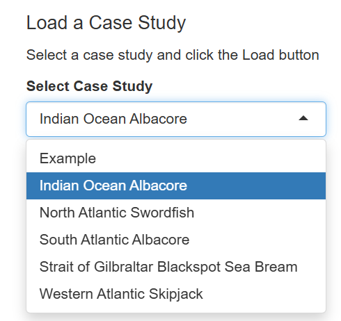

# Presentation of Results {#sec-results}

The preliminary results of the albacore MSE are presented in *Slick*,an online application designed for interactively exploring MSE results.

To view the preliminary results, open [Slick](https://shiny.bluematterscience.com/app/slick) in your web browser and select the Indian Ocean Albacore case study from the drop-down selection box (@fig-case-study-menu).

{#fig-case-study-menu width="350"}